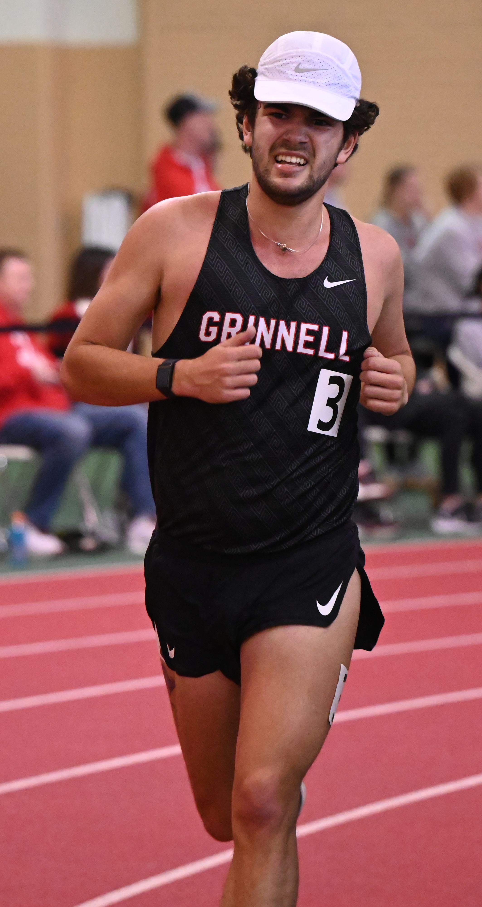

 

Alongside Statistics, my interests are focused on the outdoors. Whether running, hiking, biking, or taking photos, I enjoy spending my free time outside. Currently, I run for the Grinnell Cross Country and Track and Field team. After graduation, I will continue running semi-competitively, hopping in the occasional road or track race. To the right, I have a photo from my final 5k on the Grinnell Indoor Track. 

My creative outlet, aside from the creativity inherent in research, is taken up by photography. Since early high school, I've been taking landscape photographs, capturing my love of the outdoors. Below is a photo taken at Krum Nature Preserve just west of Grinnell.

 
